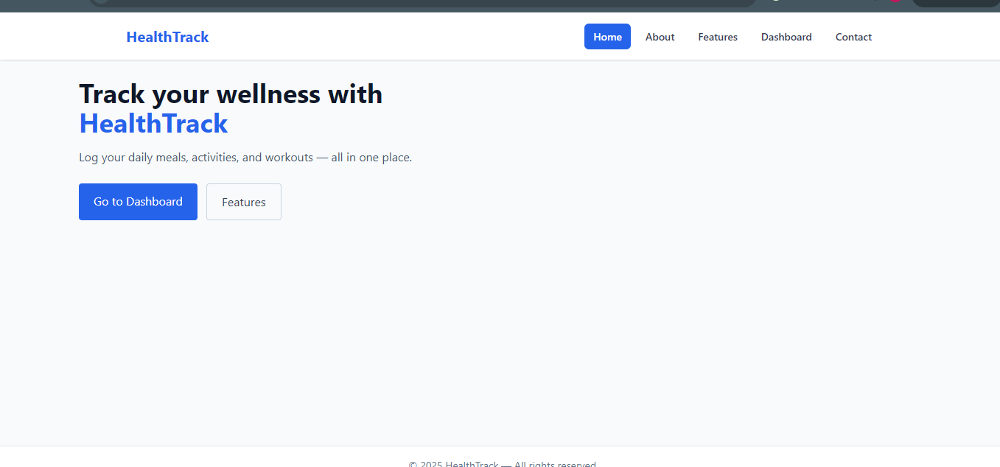
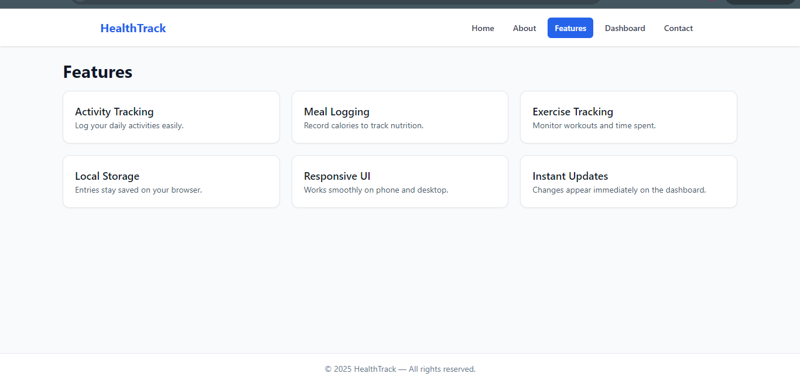

# HealthTrack

## Project Description
HealthTrack is a simple wellness tracking web application built using **ReactJS** and **Tailwind CSS**.  
The project includes five main pages: Home, About, Features, Contact, and a dynamic Dashboard page.  
Users can log their daily activities, meals, and workouts. All data is saved in the browser using **localStorage**.  
The application is fully responsive and works smoothly on both desktop and mobile devices.

---

## Setup Instructions

### 1. Clone the repository

---

## Screenshots of the UI

### Home Page


### About Page


### Features Page


### Dashboard Page


### Contact Page


```bash
git clone https://github.com/YOUR_USERNAME/YOUR_REPOSITORY.git
